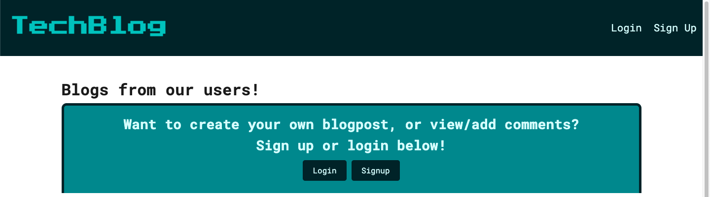
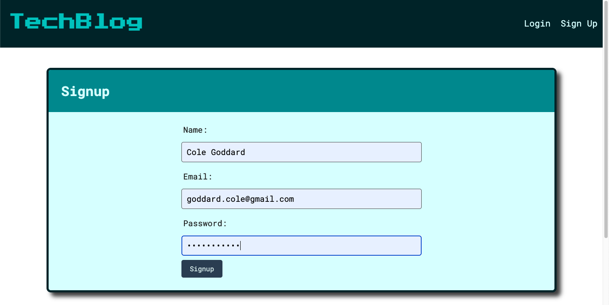
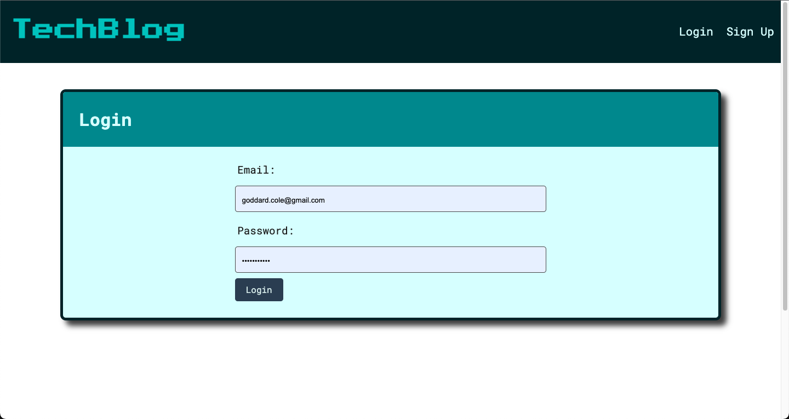
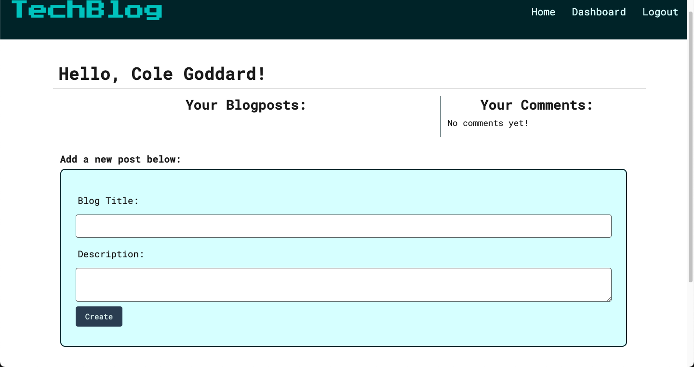
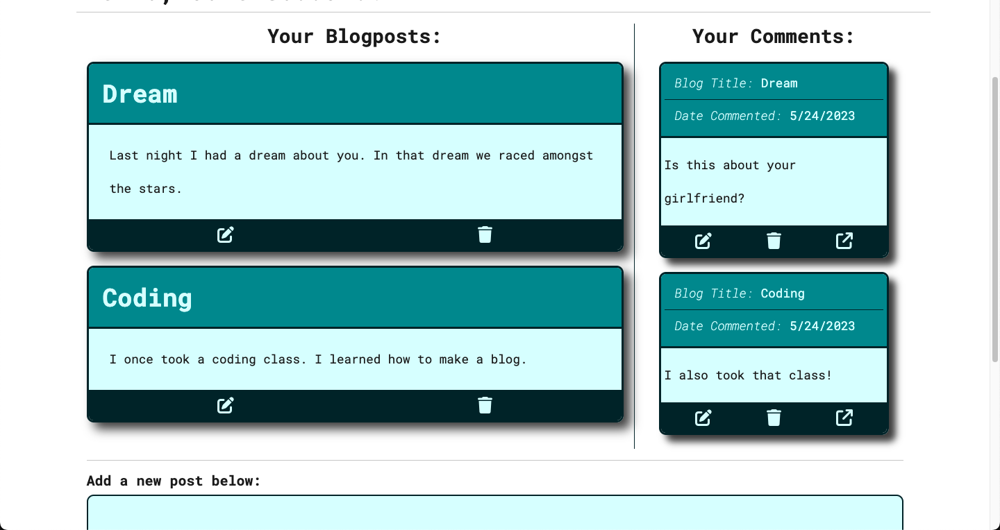

# tech-blog-MVC

## Description

 - TechBlog is a full-stack web application which follows the MVC (Model, Views, Controllers) structure. This site utilizes handlebars to easily display data to multiple pages with little repitition. Users can either sign-up or login. Once logged in, users can post new blogs from their dashboard, or comment on other users blogs on the homepage. All of the users blogs and comments are displayed on their dashboard where they can edit or delete whatever they need to. I used bootstrap as a way to easily edit existing blogs/comments by the use of modals. Bootstrap also became very useful for mobile responsiveness.

 ## Screenshots

  
 
 
 
 

 ## Installation
 - No

 ## Usage
 - No

 ## Tests
 - No

 ## Authors
- Cole Goddard: Github Username: CGoddard1
- UNCC Project Design

## Acknowledgements
- Cambric Moye: Github: Cjmoye30